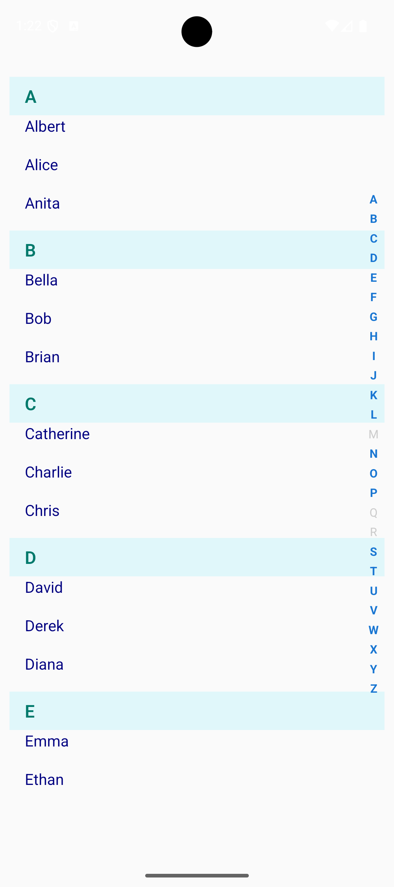

# 🔡 react-native-letter-flatlist 
## AlphabetList

<table border="0">
<tr   >
<td style="vertical-align: top; padding-right: 16px; border: none">


**AlphabetList** is a customizable FlatList-based A–Z index list component for React Native. It allows you to display large datasets grouped by alphabet with smooth scroll-to-letter functionality. The component features a vertical alphabet sidebar that users can tap to jump directly to a section. It supports custom rendering for both items and headers, as well as styling options for all UI elements. Ideal for contact lists, brand directories, or any sorted data that benefits from alphabetical navigation.

Built with TypeScript and supports local or remote images with minimal configuration.

</td>
<td   >



</td>
</tr>
</table>


---

## ✨ Features

- FlatList-based (not SectionList)
- Automatically sorts and groups items by any field
- Alphabet index on the right side (A–Z)
- Smart scroll to each letter’s first item
- Optional letter headers
- Configurable styles for headers, items, and alphabet list
- Shows full A–Z even if data doesn't cover all letters
- Built-in TypeScript support

---

## 📦 Installation

```sh
npm install react-native-letter-flatlist
```

---

## 🚀 Usage

```tsx
import React from 'react';
import { SafeAreaView, StyleSheet } from 'react-native';
import { AlphabetList } from 'react-native-letter-flatlist';

const people = [
  { name: 'Alice' },
  { name: 'Amanda' },
  { name: 'Ben' },
  { name: 'Charlie' },
  { name: 'David' },
  { name: 'Eve' },
  { name: 'Frank' },
  { name: 'Zack' },
];

export default function App() {
  return (
    <SafeAreaView style={styles.container}>
      <AlphabetList
        data={people}
        sortField="name"
        showHeader={true}
        showAllLetters={true}
      />
    </SafeAreaView>
  );
}

const styles = StyleSheet.create({
  container: {
    flex: 1,
  },
});

```

---

## ⚙️ Props
 | Prop                    | Type                            | Default   | Description                                                                 |
|-------------------------|----------------------------------|-----------|-----------------------------------------------------------------------------|
| `data`                  | `T[]`                            | —         | The array of items to display.                                              |
| `sortField`             | `keyof T`                        | —         | The key used to group and sort items alphabetically.                        |
| `renderItem`            | `(item: T) => ReactElement`      | Default   | Optional custom render for each item.                                       |
| `renderHeader`          | `(letter: string) => ReactElement`| Default  | Optional custom render for each alphabet header.                            |
| `showHeader`            | `boolean`                        | `true`    | Whether to show alphabet headers above each section.                        |
| `showAllLetters`        | `boolean`                        | `false`   | Whether to show all A–Z even if no items exist under some letters.          |
| `itemHeight`            | `number`                         | `40`      | Height for each item row (for scroll positioning).                          |
| `headerHeight`          | `number`                         | `40`      | Height for each header row (for scroll positioning).                        |
| `itemTextStyle`         | `TextStyle`                      | —         | Style override for default item text.                                       |
| `headerContainerStyle`  | `ViewStyle`                      | —         | Style override for default header container.                                |
| `headerTextStyle`       | `TextStyle`                      | —         | Style override for default header text.                                     |
| `activeAlphabetStyle`   | `TextStyle`                      | —         | Style for active (clickable) letters in the right-side index.               |
| `inactiveAlphabetStyle` | `TextStyle`                      | —         | Style for inactive (non-clickable) letters in the right-side index.         |
| `alphabetContainerStyles`| `ViewStyle`                     | —         | Style for the container of the right-side alphabet list.                    |

---

## 🎨 Style Customization

| Prop                      | Type        | Description                                                                 |
|---------------------------|-------------|-----------------------------------------------------------------------------|
| `itemTextStyle`           | `TextStyle` | Style override for the default item text.                                  |
| `headerContainerStyle`    | `ViewStyle` | Style override for the default header container.                           |
| `headerTextStyle`         | `TextStyle` | Style override for the default header text.                                |
| `activeAlphabetStyle`     | `TextStyle` | Style for active (clickable) alphabet letters in the right-side index.     |
| `inactiveAlphabetStyle`   | `TextStyle` | Style for inactive (non-clickable) alphabet letters in the right-side index.|
| `alphabetContainerStyles` | `ViewStyle` | Style for the vertical container of the right-side A–Z index.              |

---

## 🖼 Supported Image Formats

- Remote image objects: `{ uri: 'https://...' }`
- Local image assets: `require('./path/to/image.jpg')`
- Direct string URLs: `'https://example.com/image.jpg'`

---

## 🧠 Best Practices

- Outer container height of AlphabetList must be greater than or euqal to the alphabets height for better performance  

---

## 💡 Tip

To use default rendering:

- You can skip `renderItem` and/or `renderHeader` — default components will be used.
- Set `showHeader={false}` to hide alphabet section headers entirely.
- Enable `showAllLetters={true}` to display all A–Z letters on the right side, even if some letters have no matching data (they will appear disabled).

---

## 🧑 Author

Made with ❤️ by **Antos Maman**

- [GitHub](https://github.com/antosmamanktr)
- [LinkedIn](https://www.linkedin.com/in/antosmaman/)
- For issues and contributions, feel free to open a [GitHub issue](https://github.com/your-github-username/react-native-letter-flatlist/issues)


## 📄 License

[MIT](./LICENSE) Copyright (c) 2025 Antos Maman

---
